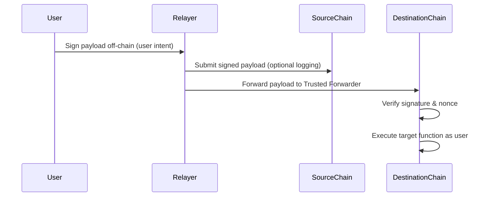

# 🔄 Cross-chain Data Flow

This document describes the core data flow of KIP-CK, outlining how a signed message is relayed and executed across different chains — without relying on bridges or wrapped tokens.

---

## 🔁 Standard Cross-chain Flow (EVM to EVM or EVM to non-EVM)

---

## 📦 Payload Structure

A typical signed payload includes:

- `origin_chain_id`  
- `destination_chain_id`  
- `user_address`  
- `function_call_data`  
- `nonce`  
- `expiration_timestamp`  
- `signature`

---

## 🛠️ Execution on Destination Chain

1. Trusted Forwarder verifies signature and nonce  
2. If valid:  
   - Extracts function call  
   - Executes on behalf of original user (`msg.sender` overridden)  
3. Result is recorded on destination chain

---

## 💬 Notes

- No need for source chain to lock funds or emit confirmation events  
- Optional source logging improves traceability  
- Payloads can be sent to **EVM or non-EVM** targets, as long as the forwarder is implemented  

---

## ✅ Summary

KIP-CK’s data flow is simple, modular, and chain-agnostic.  
It enables secure cross-chain interaction without token bridges or wrapped assets — powered only by signed intent and verifiable relayers.
